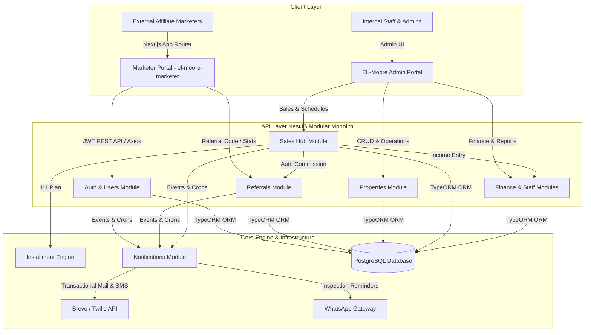

# EL-Moore — Luxury Real Estate Management System & Affiliate Marketer Portal

> **The Financial Curator:** A bespoke real estate management suite and high-end investment portal designed to replace fragmented spreadsheet workflows with automated sales tracking, customer lifecycle management, and transparent affiliate marketer commission pipelines.

---

## 🏛️ Executive Summary

**EL-Moore** is an enterprise-grade real estate operations platform and dedicated **Affiliate Marketer Portal**. Built to bridge the gap between internal sales operations and external affiliate networks, EL-Moore automates property management, sales recording (outright & installment plans), customer lifecycle progression, and real-time commission tracking.

Instead of relying on chaotic WhatsApp groups and manual Excel spreadsheets, EL-Moore gives real estate companies and independent affiliate marketers a unified, single source of truth for property listings, site inspections, payment schedules, and performance metrics.

---

## 💡 The Problem It Solves

Real estate companies in emerging and high-growth markets frequently face operational friction:

1. **Affiliate Marketer Friction & Distrust**: External sales partners (marketers) lack visibility into buyer progression and commission statuses, leading to endless manual follow-ups and payment disputes.
2. **Spreadsheet & WhatsApp Overhead**: Managing property availability, installment plans, site inspections, and staff task reports across fragmented chat apps and static files causes missed payments and untracked sales.
3. **Manual Installment Tracking**: Paper-based or un-automated installment collection leads to overdue accounts without automated notification mechanisms.
4. **Disjointed Customer Lifecycle**: Prospects and leads drop off because site inspection scheduling, birthday greetings, and follow-ups are handled manually.

---

## 🎯 What the Product Does

EL-Moore provides a dual-interface ecosystem:

1. **Affiliate Marketer Portal (`el-moore-marketer`)**: A luxury digital private portal where external sales partners register, obtain unique referral links (`/refer/:marketerCode`), track leads through every sales stage, monitor pending vs. paid commissions, and access marketing collaterals.
2. **Core Real Estate Operating System (`el-moore-api` / internal dashboards)**: An end-to-end administration platform for managing property inventories, customer lifecycle transitions, staff attendance/geolocation clock-ins, daily task reporting, office finances (income/expenses), and automated multi-channel messaging (Email & SMS via Brevo/Twilio, WhatsApp site follow-ups).

---

## 👨‍💻 My Specific Contribution

As the lead developer on the **Affiliate Marketer Portal (`el-moore-marketer`)** and core technical architecture contributor:

- **Designed & Implemented the Frontend Architecture**: Built the responsive, Next.js 16 App Router application with React 19, TypeScript, Tailwind CSS v4, Framer Motion, and Radix UI components.
- **Crafted the "Estate Sovereign / Financial Curator" Design System**: Implemented the bespoke brand identity based on `el-moore-full-brand-guide.pdf`, featuring custom Axiforma typography, HSL/Hex color tokens (Deep Forest Green `#142C26`, Champagne Gold `#CDBF8A`, Fine Paper `#FAF9F5`), glassmorphism effects, and strict "no-line borderless sectioning" rules.
- **Engineered Full Authentication & Portal Flow**: Developed secure JWT authentication (`/marketer`), self-registration approval workflows (`/marketer/register`), and session management (`contexts/auth-context.tsx`).
- **Built Interactive Analytics & Ledgers**: Created high-performance dashboards, real-time stat counters, searchable referrals data tables, and commission payout ledgers.
- **API Client & Mock Infrastructure**: Architected a dual-mode TypeScript API layer (`lib/api/client.ts`, `lib/api/referrals.ts`, `lib/api/auth.ts`) supporting live NestJS REST endpoints and seamless mock fallback execution for offline testing.

---

## 🏗️ System Architecture

The EL-Moore platform is structured as a **modular monolith backend** paired with a **decoupled Next.js frontend application**:



### Database Entity Model Highlights

The database uses `sales` as the central relational hub linking buyers, properties, and external marketers:

```
users (Marketers / Staff / Admins)
   │
   ├── (1:M) ──> sales (Hub Table) <── (1:M) ── properties
   │               │
   │               ├── (1:1) ──> installment_plans ── (1:M) ──> installment_payments
   │               ├── (1:M) ──> sale_documents
   │               ├── (1:M) ──> referrals (Commissions)
   │               └── (1:M) ──> financial_transactions (Income)
   │
   └── (1:M) ──> site_inspections <── (1:M) ── customers
```

---

## 🛠️ Technologies & Stack

### Frontend Application (`el-moore-marketer`)
- **Framework**: Next.js 16.2.0 (App Router, React Server & Client Components)
- **Core Library**: React 19.2.4 & TypeScript 5
- **Styling**: Tailwind CSS v4, PostCSS, Vanilla CSS Design System Tokens
- **Animations**: Framer Motion 12.38.0
- **UI Architecture**: Radix UI primitives, Lucide React icons, Sonner toast notifications, Recharts 3.8
- **Typography**: Axiforma (Custom licensed woff2 font family)

### Backend API (`el-moore-api`)
- **Framework**: NestJS (TypeScript Modular Monolith)
- **Database & ORM**: PostgreSQL & TypeORM
- **Authentication**: JWT Strategy, Passport.js, RBAC Guards
- **Notification Services**: Brevo API (Email), Twilio (SMS), WhatsApp integration
- **Scheduled Jobs**: NestJS Schedule (Cron for birthday greetings, payment reminders, inspection follow-ups)

---

## 🎨 Important Technical & Design Decisions

### 1. The "No-Line" Borderless Design System
To distance EL-Moore from basic generic templates, we enforced the **"Financial Curator"** aesthetic:
- **Prohibited Sectioning Lines**: Subdued background shifts (`surface`, `surface_container_low`, `surface_container_lowest`) are used instead of explicit `border-b` or `border-r` lines.
- **Layered Paper Metaphor**: Containers stack like heavy vellum paper with custom ambient shadows (`rgba(27, 28, 26, 0.06)` with `40px` blur).
- **Brand Palette**: Deep Forest Green (`#142C26`) conveys stability and institutional trust, paired with Champagne Gold (`#CDBF8A`) for premium accents and metrics.

### 2. `sales` Hub Database Architecture
Rather than creating disconnected data silos, `sales` acts as the single transactional origin point:
- Linking a sale automatically evaluates `marketer_id`. If an external affiliate is present, a `referrals` record is auto-generated with calculated commission.
- If the sale type is `INSTALLMENT`, an `installment_plans` record and schedule are generated atomically.
- Automatically generates an `INCOME` entry in `financial_transactions`.

### 3. Strict Scope Separation for Marketers vs Internal Staff
- **Internal Marketers**: Salaried employees assigned to sales; they do *not* generate commission referral records.
- **External Affiliate Marketers**: Partners registered via the Marketer Portal. They earn tiered commission records tracked exclusively through the `referrals` table.

### 4. Soft Voiding Over Hard Deletion
Sales records are never deleted hard from SQL. When canceled, they transition to `status: VOIDED`. This preserves complete audit logs for accounting, commission reporting, and tax reporting.

---

## ✨ Key Features

### 🌟 Marketer Portal (`el-moore-marketer`)
- **Affiliate Self-Registration**: Streamlined application form with instant pending-approval status tracking.
- **Custom Referral Links**: Auto-generated tracking link (`/refer/:marketerCode`) for every verified marketer.
- **Real-Time Earnings Overview**: At-a-glance stat cards showing **Total Commission Earned**, **Pending Payouts**, **Total Referrals**, and **Conversion Rate**.
- **Referrals Ledger & Search**: Filterable, searchable data table displaying customer names, property titles, sale values, commission amounts, and live statuses (`PENDING`, `APPROVED`, `PAID`).
- **Account & Payout Settings**: Secure management of payout banking details, contact info, and security credentials.

### 🏢 Internal Real Estate Engine
- **Property Portfolio Management**: Full CRUD for properties, multi-image galleries, cover selection, and availability states (`AVAILABLE`, `RESERVED`, `SOLD`).
- **Automated Customer Lifecycle**: Seamless transition: `Prospect` (Inquiry) → `Lead` (Site Inspection) → `Client` (First Purchase) → `Customer` (Repeat Buyer).
- **Automated Multi-Channel Communication**: Event-triggered Email + SMS notifications for installment due dates, birthday greetings, and commission payouts.
- **Staff Operations & Task Reports**: Geolocation-flagged clock-in/out attendance logs and daily task submission feeds for management oversight.

---

## 📸 Interface & Design Highlights

> [!NOTE]
> Below is a breakdown of key portal screens implemented in the `el-moore-marketer` interface.

```
+-----------------------------------------------------------------------------------+
|  EL-MOORE MARKETER PORTAL                                   [ Logout ] [ Profile ]|
+-----------------------------------------------------------------------------------+
|                                                                                   |
|  WELCOME BACK, ALEX                                                               |
|  Track your referral links, closed sales, and pending payouts in real time.       |
|                                                                                   |
|  +-------------------+  +-------------------+  +-------------------+              |
|  | TOTAL COMMISSION  |  | PENDING PAYOUTS   |  | TOTAL REFERRALS   |              |
|  | ₦ 4,850,000       |  | ₦ 1,200,000       |  | 14 Clients        |              |
|  +-------------------+  +-------------------+  +-------------------+              |
|                                                                                   |
|  RECENT REFERRAL TRANSACTIONS                                                     |
|  Search: [ Enter customer or property... ]      Status: [ All Statuses v ]        |
|  +-----------------------------------------------------------------------------+  |
|  | Customer       | Property           | Date       | Commission | Status      |  |
|  +-----------------------------------------------------------------------------+  |
|  | Chief O. Musa  | Imperial Heights   | Oct 02     | ₦ 450,000  | PAID [v]    |  |
|  | Dr. A. Bello   | Sovereign Park     | Sep 28     | ₦ 750,000  | PENDING     |  |
|  | Mrs. F. Ade    | Grace Palm Estate  | Sep 14     | ₦ 300,000  | PAID        |  |
|  +-----------------------------------------------------------------------------+  |
+-----------------------------------------------------------------------------------+
```

---

## ⚡ Challenges & Solutions

### Challenge 1: Preventing Double-Counting in Mixed Sales Teams
*Problem*: Real estate deals often involve both an internal sales team member and an external affiliate referrer.
*Solution*: Architected explicit foreign key relationships (`sold_by_id` vs `marketer_id`) on the `sales` entity. Internal staff sales track performance metrics without triggering external commission accounts, ensuring zero financial discrepancy in ledger calculations.

### Challenge 2: Achieving High-End Luxury Aesthetic Without Performance Penalty
*Problem*: Typical luxury sites suffer from slow load times due to heavy media and bloated UI libraries.
*Solution*: Built lightweight UI primitives using Radix UI and Tailwind CSS v4, utilizing CSS variables for theme switching. Managed smooth entrance animations via hardware-accelerated Framer Motion transforms without layout shifts.

### Challenge 3: Reliable Development & Offline Capability
*Problem*: Backend NestJS API development was occurring in parallel with frontend portal construction.
*Solution*: Designed `lib/api/client.ts` with transparent fallback mock providers. When API endpoints are offline or un-deployed, the portal seamlessly switches to type-checked local mock stores without throwing runtime errors.

---

## 🚀 Setup & Local Installation

### Prerequisites
- **Node.js**: `v18.x` or `v20.x` higher
- **Package Manager**: `npm`, `pnpm`, or `bun`

### Installation Steps

1. **Clone the repository**:
   ```bash
   git clone https://github.com/Hayotunday/el-moore-marketer.git
   cd el-moore-marketer
   ```

2. **Install dependencies**:
   ```bash
   npm install
   ```

3. **Configure environment variables**:
   Create a `.env.local` file in the root directory:
   ```env
   NEXT_PUBLIC_API_URL=http://localhost:3000/api
   ```

4. **Run the development server**:
   ```bash
   npm run dev
   ```

5. **Access the application**:
   Open [http://localhost:3000/marketer](http://localhost:3000/marketer) in your browser to view the portal.

---

## 🔥 Technical Highlights

- 💎 **Bespoke Design System**: Custom typography tokens, glassmorphism headers, and zero-border card layouts.
- ⚡ **Next.js 16 App Router**: Optimized route grouping `(marketer)` with instant layouts and client transitions.
- 🛡️ **End-to-End Type Safety**: Shared TypeScript DTOs and API interfaces across frontend and backend layers.
- 📱 **Fully Responsive**: Fluid grid layouts adapted across desktop, tablet, and mobile screens.

---

## 📄 License

This project is proprietary software belonging to **EL-Moore Real Estate**. All rights reserved.

